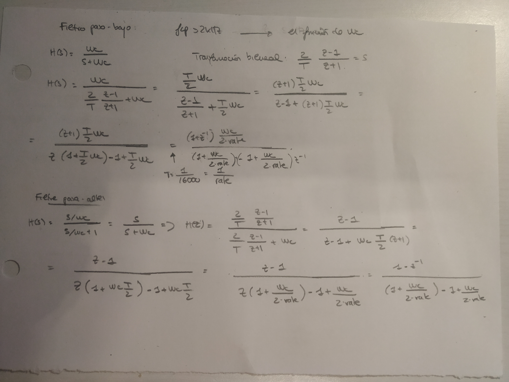

PAV - P3: detección de pitch
============================

Esta práctica se distribuye a través del repositorio GitHub [Práctica 3](https://github.com/albino-pav/P3).
Siga las instrucciones de la [Práctica 2](https://github.com/albino-pav/P2) para realizar un `fork` de la
misma y distribuir copias locales (*clones*) del mismo a los distintos integrantes del grupo de prácticas.

Recuerde realizar el *pull request* al repositorio original una vez completada la práctica.

Ejercicios básicos
------------------

- Complete el código de los ficheros necesarios para realizar la detección de pitch usando el programa
  `get_pitch`.

   * Complete el cálculo de la autocorrelación e inserte a continuación el código correspondiente.

**`Podemos ver que hemos seguido la fórmula que en su momento se nos explicó en clase:`**

**`Aquí podemos ver el código del cálculo de la autocorrelación. Podemos ver que hemos sido fieles con los nombres de los índices (los 'i' y 'k' que salen en la fórmula de teoria)`**

   * Inserte una gŕafica donde, en un *subplot*, se vea con claridad la señal temporal de un sonido sonoro
     y su periodo de pitch; y, en otro *subplot*, se vea con claridad la autocorrelación de la señal y la
	 posición del primer máximo secundario.
	 
**` Podemos observar el código de comparación entre la señal (audio diciendo la vocal 'a' continuamente, sonido sonoro) y el cálculo de su pitch a partir de la autocorrelación. Primera implementación con Matlab:`**

**`Simplemente se lee la señal utilizando la función de Matlab audioread, ploteamos esta y calculamos la autocorrelación utilizando una código muy similar al del apartado anterior:`**

**` La gráfica está representada en muestras, y nos da un pitch aproximado de 122 muestras. Por tanto, nos da un pitch de f = 131Hz. Como la señal es sonora, sabemos que la autocorrelación debe de ser periódica y del mismo periodo. Lo comprobamos mirando el periodo de la señal original`**

**`El resultado es de aproximadamente 108 muestras por lo que nos queda una frecuencia de 148Hz.`**

**`Opcionalmente, después de verificar los cáclulos en matlab, nos hemos instalado la librería matplotlib y hemos hecho también las gráficas con Python, para ir adquiriendo conocimientos. Podemos observar que el resultado es el mismo. Aquí podemos ver el código de Python comentado, con la gráfica adjuntada si ejecutamos el código debajo.`**

	 NOTA: es más que probable que tenga que usar Python, Octave/MATLAB u otro programa semejante para
	 hacerlo. Se valorará la utilización de la librería matplotlib de Python.

   * Determine el mejor candidato para el periodo de pitch localizando el primer máximo secundario de la
     autocorrelación. Inserte a continuación el código correspondiente.

**`Podemos observar el código usado para determinar el mejor candidato para el periodo de pitch en el siguiente fragmento:`**

**`El resultado, mostrando por pantalla, del código anterior es el siguiente:`**

**`Los resultados son los periodos de pitch estimados en cada trama de 30ms (desplazadas cada 15ms). La señal usada es la misma que en el apartado anterior, una señal con un sonido vocálico 'a' constante. Podemos apreciar como los valores oscilan sobre los 133Hz, un valor muy similar al obtenido con los códigos de matlab y python anteriores.`**

   * Implemente la regla de decisión sonoro o sordo e inserte el código correspondiente.
   
   **`Para implementar la regla de decisión nos hemos basado en una señal creada por nosotros como ejemplo. Esta señal, nos daba los siguientes valores :`**
   
   

  **`Que hemos obtenido su visualización poniendo un 1 en los #if siguientes:`**
  
   

   **`Basandonos en estos resultados, hemos decidido entonces, que de momento la regla de decision es la siguiente:`**
   
   

- Una vez completados los puntos anteriores, dispondrá de una primera versión del detector de pitch. El 
  resto del trabajo consiste, básicamente, en obtener las mejores prestaciones posibles con él.

  * Utilice el programa `wavesurfer` para analizar las condiciones apropiadas para determinar si un
    segmento es sonoro o sordo. 
	
	  - Inserte una gráfica con la detección de pitch incorporada a `wavesurfer` y, junto a ella, los 
	    principales candidatos para determinar la sonoridad de la voz: el nivel de potencia de la señal
		(r[0]), la autocorrelación normalizada de uno (r1norm = r[1] / r[0]) y el valor de la
		autocorrelación en su máximo secundario (rmaxnorm = r[lag] / r[0]).

**`Podemos observar la señal y el cálculo de su pitch. La señal debe tener un pitch aproximadamente constante debido a que se trata de la repetición de la vocal a `**
		

		 
**`Los candidatos a la sonoridad de voz son los siguientes para cada trama: `**
		 

		 
**` Para cada trama, tenemos representado: el valor de la autocorrelación en el pitch, seguidamente la potencia de esa trama realizado con el 10log(r(0)) (aprox de -20 dB), además de la autocorrelación normalizada (aprox 0.9) y en su máximo secundario (aprox 0.6). Estos valores corresponden a un tramo de señal sonora. Si lo realizamos con una señal aleatoria: `**
		 
**`Para la mejora de decisión si es sonoro o sordo, hemos mejorado el sistema utilizando la tasa de cruces por cero con el siguiente código (basado en el cálculo realizado en la práctica 1), además hemos utilizado la potencia para establecer más condiciones en la condición: `**
		

		
**`Hemos añadido tres variables (noise_power, ZCR_threshold y number_frames) donde las dos primeras serán para establecer un umbral a partir de la primera trama (cuando number_frame = 0). Estos valores los utilizaremos para decidir si la trama es sorda o sonora en la función unvoiced. Nos queda de la manera siguiente:  `**
		 

		 
**` El resultado de una señal de voz de prueba en la cual decimos la palabra mama es la siguiente:`**
		 

Puede considerar, también, la conveniencia de usar la tasa de cruces por cero.
		
**`Si añadimos la tasa de cruces por cero, la puntuación total disminuye. Hemos provado con diferentes umbrales pero no conseguimos subirla. Por lo tanto, lo hemos dejado comentado. Lo probaremos luego cuando hagamos las ampliaciones. Este es el resultado que obtenemos:`**

Recuerde configurar los paneles de datos para que el desplazamiento de ventana sea el adecuado, que en esta práctica es de 15 ms.

- Use el detector de pitch implementado en el programa `wavesurfer` en una señal de prueba y compare su resultado con el obtenido por la mejor versión de su propio sistema.  Inserte una gráfica ilustrativa del resultado de ambos detectores.

**` Utilizando una señal de prueba, el resultado de nuestro pitch calculado con el de wavesurfer es el siguiente:`**

  
  * Optimice los parámetros de su sistema de detección de pitch e inserte una tabla con las tasas de error
    y el *score* TOTAL proporcionados por `pitch_evaluate` en la evaluación de la base de datos 
	`pitch_db/train`..

**` Aquí podemos ver como ha quedado la puntuación total después de haber ajustado bien los umbrales:`**

**` La condición para voiced y unvoiced ha sido la siguiente: `**

   
   * Inserte una gráfica en la que se vea con claridad el resultado de su detector de pitch junto al del
     detector de Wavesurfer. Aunque puede usarse Wavesurfer para obtener la representación, se valorará
	 el uso de alternativas de mayor calidad (particularmente Python).
	 
   **` El resultado de la comparación utilizando el wavesurfer es el siguiente:`**
   
   
   
   **` Como se comenta en el propio enunciado, además de la propia representación de wavesurfer, hemos hecho un código en python para poder representarlo con mayor calidad. Hemos hecho un Save Data File en el pitch contour para extraer un fichero .f0 con las siguientes propiedades:`**

**` El programa usado es el siguiente:`**

**` Y el resultado el siguiente:´**

**` Por si se quiere comprar el uso de ese código con otras señales y ficheros se ha añadido al repositorio una carpeta llamada comparacion_detectores donde dentro está el código usado con las señal para hacer la demostración.´**

Ejercicios de ampliación
------------------------

- Usando la librería `docopt_cpp`, modifique el fichero `get_pitch.cpp` para incorporar los parámetros del
  detector a los argumentos de la línea de comandos.
  
  Esta técnica le resultará especialmente útil para optimizar los parámetros del detector. Recuerde que
  una parte importante de la evaluación recaerá en el resultado obtenido en la detección de pitch en la
  base de datos.

  * Inserte un *pantallazo* en el que se vea el mensaje de ayuda del programa y un ejemplo de utilización
    con los argumentos añadidos.

- Implemente las técnicas que considere oportunas para optimizar las prestaciones del sistema de detección
  de pitch.

  Entre las posibles mejoras, puede escoger una o más de las siguientes:

  * Técnicas de preprocesado: filtrado paso bajo, *center clipping*, etc.
  
  **`El center clipping es una técnica sencilla que consiste en básicamente anular los valores de la señal de magnitud pequeña. Con ello se prentende aumentar la intensidad de ármonicos de orden elevado, gracias a introducir una disotrsion no lineal, y aumentar la robustez frente al ruido.`**
  
    **`Podemos ver que hemos hecho el center-clipping con offset i sin offset. Hemos probado los dos y nos daba más puntuación el center clipping sin offset. Aún así, hemos dejado la opción de usar el center clipping con offset si queremos. El código queda de la siguiente forma:`**
  
     
     
    **`Implementación del filtrado paso bajo y filtrado paso alto: lo que pretendemos es eliminar tanto ruido comos sea posible y particularmente, el filtrado paso bajo para quedarnos con la parte del principio del espectro, donde se aprecian mejor los armónicos. Hemos establecido los valores en función de los resultados del test de pitch. Hemos realizado el cálculo de los coeficientes de manera manual y nos hemos creado un objecto DigitalFilter que a su vez llamará a una función para realizar el filtrado. El cálculo de los coeficientes de los filtros es el siguiente: `**
    
    
   
    **` El código resultante es el siguiente: `**
      
     

  * Técnicas de postprocesado: filtro de mediana, *dynamic time warping*, etc.
  
      **`Hemos usado el filtro de mediana: `**
     
     
     
     **`Con este algoritmo lo que hacemos constantemente es hacer una copia de la muestra anterior de f0, la muestra actual de f0 y la siguiente muestra de f0. Entonces, ordenamos el vector donde hay las tres copias y escojemos la mediana.`**

  * Métodos alternativos a la autocorrelación: procesado cepstral, *average magnitude difference function*
    (AMDF), etc.
    **`Hemos usado el AMDF (average magnitude difference function):`**
    
    
    
    **`El código usado solo tiene los siguientes cambios:´**

	
	
	
    
    **`Con este algoritmo hemos obtenido un resultado de (¿?¿?), por lo que perdemos calidad respeccto los resultados del algoritmo de la autocorrelación.´**
    
  * Optimización **demostrable** de los parámetros que gobiernan el detector, en concreto, de los que
    gobiernan la decisión sonoro/sordo.
  * Cualquier otra técnica que se le pueda ocurrir o encuentre en la literatura.
  **` En teoria se nos ha mencionado el ASDF (average squared difference function) y lo hemos implementado del mismo modo que el AMDF, solamente modificando lo siguiente:´**
  
  
  
  **`Con esta implementación hemos obtenido una mejora sustanciable, hablamos de un (?¿?¿%).`**
  
  **`Además, indagando por internet, encontramos el siguiente paper de Ghulam Muhammad del Departamento de 'Computer Engineering' de la Universidad King Saud de Arabia Saudi donde expone algunos algoritmos de detección de pitch. Uno de ellos es el circular AMDF (CAMDF):`**
    
    
    
  **`Esta función mejora la tendencia de caida del AMDF. La única parte del código que hemos modificado es la siguiente:`**
  
    
   
  **`Con esta función obtenemos un 91.18%, que es el máximo obtenido hasta el momento:`**
  
    
      	
  Encontrará más información acerca de estas técnicas en las [Transparencias del Curso](https://atenea.upc.edu/pluginfile.php/2908770/mod_resource/content/3/2b_PS Techniques.pdf)
  y en [Spoken Language Processing](https://discovery.upc.edu/iii/encore/record/C__Rb1233593?lang=cat).
  También encontrará más información en los anexos del enunciado de esta práctica.

  Incluya, a continuación, una explicación de las técnicas incorporadas al detector. Se valorará la
  inclusión de gráficas, tablas, código o cualquier otra cosa que ayude a comprender el trabajo realizado.

  También se valorará la realización de un estudio de los parámetros involucrados. Por ejemplo, si se opta
  por implementar el filtro de mediana, se valorará el análisis de los resultados obtenidos en función de
  la longitud del filtro.
   

Evaluación *ciega* del detector
-------------------------------

Antes de realizar el *pull request* debe asegurarse de que su repositorio contiene los ficheros necesarios
para compilar los programas correctamente ejecutando `make release`.

Con los ejecutables construidos de esta manera, los profesores de la asignatura procederán a evaluar el
detector con la parte de test de la base de datos (desconocida para los alumnos). Una parte importante de
la nota de la práctica recaerá en el resultado de esta evaluación.
